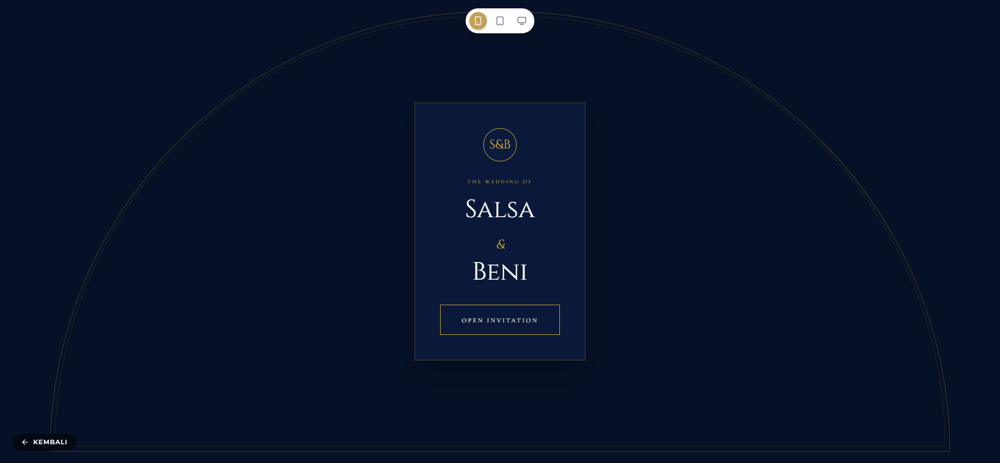
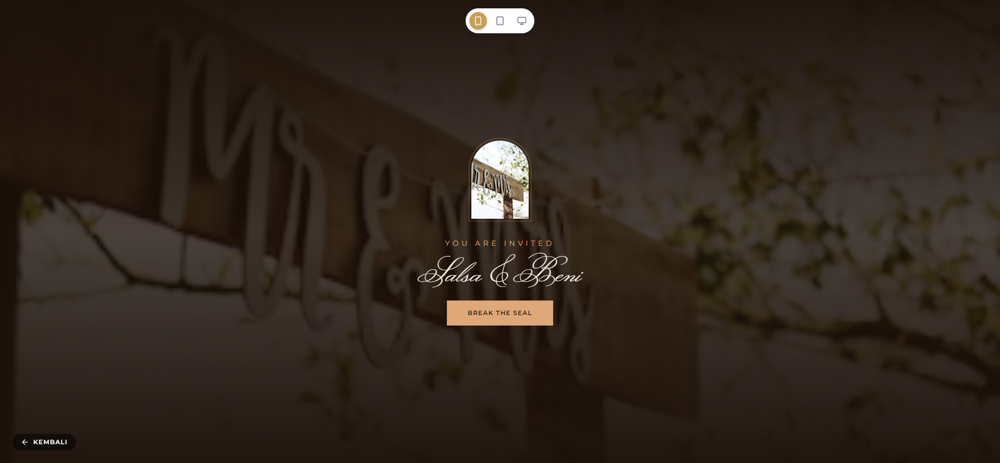
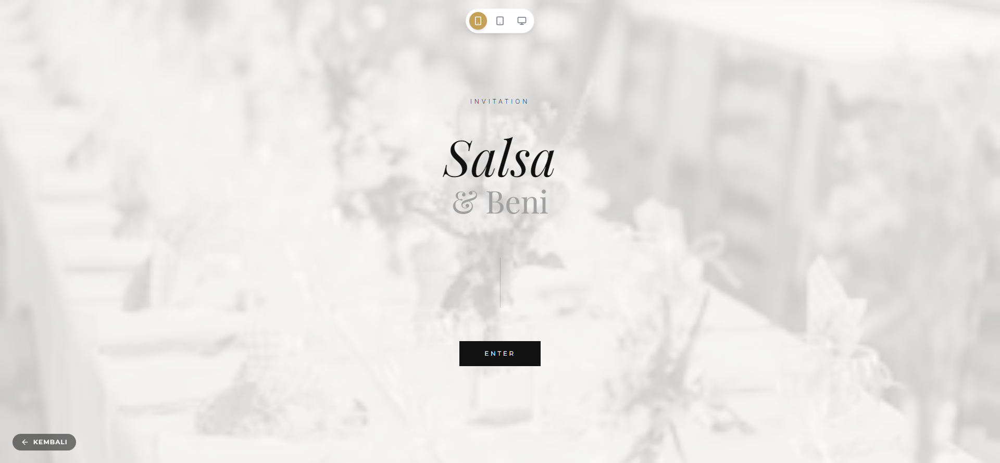

# FiveInvitation - Premium Digital Invitation Platform

Platform pembuatan undangan digital mandiri dengan integrasi instan, pembayaran otomatis (Midtrans), dan kustomisasi dinamis. Dibangun menggunakan teknologi modern React, Vite, TailwindCSS, dan Node.js/Supabase.

## 📸 Preview Tema (Playwright Captures)

Berikut adalah beberapa hasil capture tema premium yang berjalan di platform ini:

<div align="center">
  
  
  
</div>

> *Catatan: Gambar di atas diambil secara otomatis menggunakan browser engine Playwright MCP.*

## 🏗 Struktur Proyek (Arsitektur)

Proyek ini menggunakan arsitektur modular yang memisahkan antara Layout utama, halaman bisnis (Pages), sistem rendering Tema (Themes), dan backend API.

- **`/src/pages`**
  Berisi halaman-halaman utama aplikasi seperti `Home`, `Themes` (Katalog), `Order` (Pemesanan), `Track` (Status Order), dan `Preview` (Live Demo).
- **`/src/themes`**
  Ini adalah inti dari *engine* undangan. Folder ini menyimpan semua *template* undangan premium seperti seri `Luxury`, `Floral`, `Minimalist`, dll.
  - `registry.tsx`: Bertindak sebagai pendaftar (registry) untuk mengkatalogkan tema mana yang aktif, lengkap dengan referensi komponen, harga, dan metadata-nya.
- **`/src/layouts`**
  Berisi `Layout.tsx` yang menangani UI Navbar, transisi mode gelap/terang, dan lokalisasi bahasa untuk halaman publik.
- **`/src/components/Interactive`**
  Menampung *micro-components* yang ditanamkan ke dalam tema, seperti sistem *smooth scrolling* (Lenis) dan animasi performa tinggi (GSAP/Framer Motion).
- **`/server.ts`**
  Backend Express.js (`tsx server.ts`) yang menangani pendaftaran tema dinamis, otentikasi admin, pengiriman OTP email, dan integrasi dengan API eksternal (Supabase & Midtrans).

## 🚀 Cara Menjalankan (Local Development)

1. **Install Dependencies**
   ```bash
   npm install
   ```

2. **Jalankan Server Mode Dev**
   ```bash
   npm run dev
   ```
   *Aplikasi frontend dan backend akan berjalan serentak di `http://localhost:3000` dengan dukungan Hot Module Replacement (HMR) dari Vite.*

3. **Build untuk Produksi**
   ```bash
   npm run build
   npm start
   ```

## 🚀 Panduan Deployment (Vercel)

Aplikasi ini sudah dioptimalkan untuk di-deploy ke **Vercel** dengan arsitektur Vite + Serverless Functions.

1.  **Fork/Clone repository ini** ke akun GitHub Anda.
2.  **Buat Project Baru di Vercel**, hubungkan ke repository Anda.
3.  **Vercel Build Settings:**
    *   **Framework Preset:** Vite
    *   **Build Command:** `npm run build:vercel`
    *   **Output Directory:** `dist`
    *   **Install Command:** `npm install`
4.  **Konfigurasi Environment Variables di Vercel:**
    Anda wajib memasukkan key berikut di menu Settings > Environment Variables Vercel:

    ```env
    # --- Supabase (Database) ---
    VITE_SUPABASE_URL=https://your-project.supabase.co
    VITE_SUPABASE_ANON_KEY=your-anon-key
    
    # --- Midtrans (Payment Gateway) ---
    VITE_MIDTRANS_CLIENT_KEY=your-midtrans-client-key
    MIDTRANS_SERVER_KEY=your-midtrans-server-key
    MIDTRANS_IS_PRODUCTION=false # Ubah ke true jika sudah rilis
    
    # --- Keamanan Admin ---
    ADMIN_PASSWORD=password-super-kuat-anda
    ADMIN_TOKEN_SECRET=string-acak-panjang-min-32-karakter
    
    # --- Konfigurasi URL ---
    VITE_APP_URL=https://domain-anda.com
    APP_URL=https://domain-anda.com
    
    # --- (Opsional) SMTP Email untuk OTP ---
    SMTP_HOST=smtp.gmail.com
    SMTP_PORT=465
    SMTP_SECURE=true
    SMTP_USER=email-anda@gmail.com
    SMTP_PASS=app-password-gmail-anda
    ```
5. Klik **Deploy**!
6. **Penting untuk Midtrans:** Pastikan Anda menambahkan Webhook URL di dashboard Midtrans (Settings > Configuration) menunjuk ke:
    `https://domain-anda.com/api/webhook/midtrans`


## ✨ Tema Premium Tersedia
Platform ini menyediakan koleksi tema yang secara berkala di-update:
- Luxury Series (`Luxury01` hingga `Luxury06` termasuk *Royal Elegance* dan *Golden Majesty*)
- Minimalist, Floral, Dark, Cinematic, dan Islamic.
